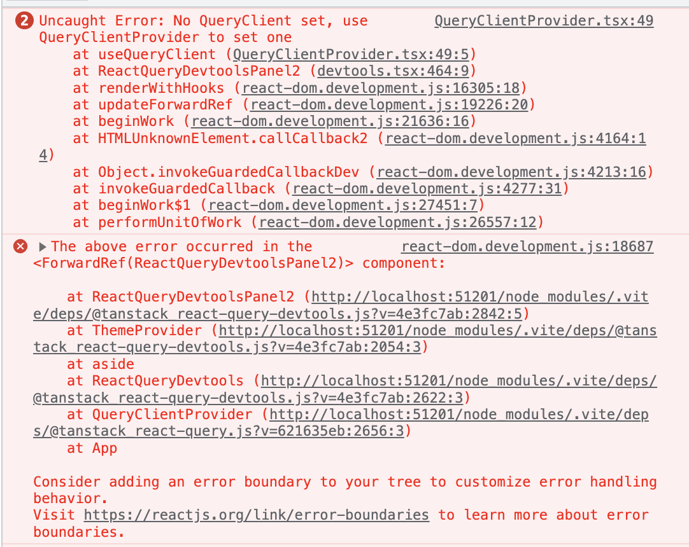

### Intro
This is a demo repository to show bug that we found 
in our production project. 

### Setup
We have a monorepository on the base of `turborepo`, 
every app is run locally and build by `vite`. Both apps 
use `react-query`, and they can have different versions 
of it because this dep defined in apps' package.json, 
not in a root one.

### Problem
Everything worked fine until at some point we started to 
have an error like in screenshot and white screen at the
local run of one of apps. This problem was floating,
sometimes it is occurring and sometimes it is disappearing.

### Attempts to solve it
1. We deleted \<ReactQueryDevtools/> and everything started
to work. But that's definitely not a solution because
we need to devtools.

2. We installed the same version of `react-query` 
packages in both apps and it worked. But that is just 
a temporary hack because monorepo allows to have 
different versions and we didn't want to
be restricted by this bug. 
3. Then we remembered that recently we added new
dependency `@suspensive/react-query`. We tried to remove it
and everything worked. So it seems that the root of the
problem somewhere inside this package.
